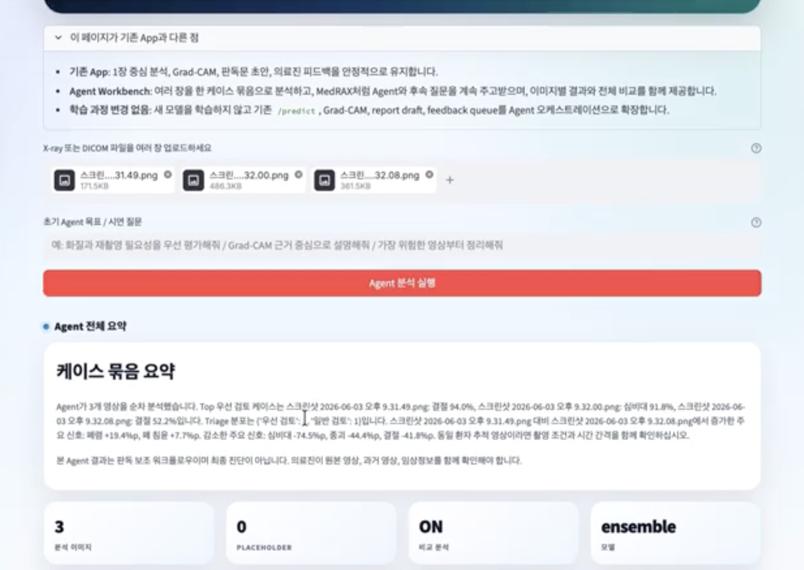
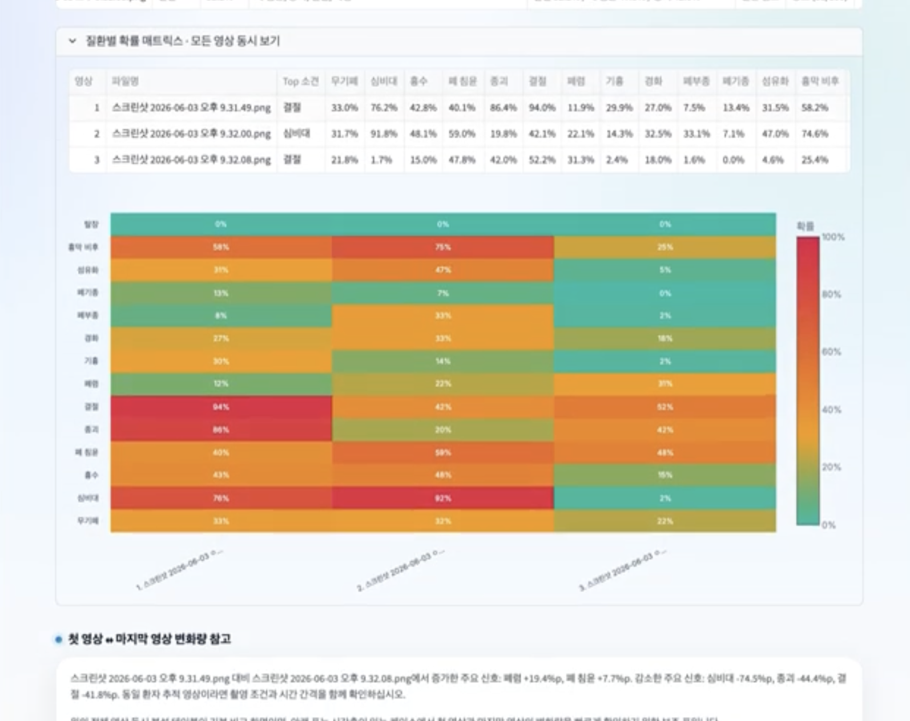
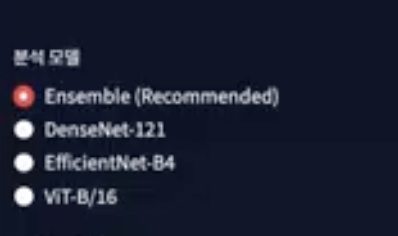

<div align="center">

# CXR-CAD AI Agent

**A reliability-aware chest X-ray CAD assistant that connects multi-label disease prediction, explainability, clinician feedback, and agentic case review in one workflow.**

Upload a chest X-ray image or DICOM file, review suspected findings, inspect model attention, generate an editable report draft, compare multiple cases, and route clinician feedback into a review queue.

[Demo Video](https://drive.google.com/file/d/1bgSycOwmrIX82I-phvk34ngxv-HMjbI0/view?usp=drive_link) · [Product Differentiation](docs/product_differentiation.md) · [Dashboard Decision Loop](docs/dashboard_decision_loop.md) · [Decision Logic](docs/decision_logic.md) · [Agentic Workflow](docs/agentic_workflow.md) · [Technical Guide](docs/technical_guide.md) · [Model Evaluation](docs/model_evaluation.md)

</div>

---

## Core Differentiation

Most chest X-ray AI demos stop at a probability table. CXR-CAD AI Agent extends that output into a review workflow: image quality checks, DICOM-aware metadata handling, heatmap context, anatomy-oriented reasoning, editable report drafts, multi-image comparison, reliability readiness checks, and clinician feedback capture.

> **A probability score is not enough for clinical review.**  
> This project turns model output into a structured, auditable CAD assistant workflow.

| Common approach | Limitation | CXR-CAD AI Agent difference |
| --- | --- | --- |
| Classification notebook | Produces metrics but is not easy to operate during a demo or review session | Provides API, dashboard, report draft, feedback queue, and multi-case workbench |
| Single-image prediction demo | Shows only disease probabilities | Adds image quality, attention-map context, triage framing, and editable findings/impression drafts |
| Heatmap-only viewer | Visual explanation is disconnected from reliability decisions | Connects Grad-CAM, shortcut-risk review, ROI consistency, and readiness checks |
| Single-model dashboard | Model choice and checkpoint state are unclear | Supports selectable inference modes and clearly marks placeholder versus real checkpoint inference |
| Prompt-only medical chatbot | LLM answers may be detached from actual model outputs | Agent answers are grounded in the current case payload, tool trace, probabilities, metadata, and report draft |

More comparison details are available in [Product Differentiation](docs/product_differentiation.md).

---

## Core Features

### 1. Chest X-ray and DICOM upload workflow



The dashboard accepts common image files and DICOM inputs. The API parses the uploaded payload, normalizes it for inference, extracts available metadata, and generates a case ID for tracking.

### 2. Multi-label thoracic finding prediction



The system predicts probabilities for 14 thoracic findings and returns detected labels based on the selected threshold. The output includes the top finding, top probability, detected disease list, and inference status.

### 3. Model selection and checkpoint-aware inference



Users can select the inference mode from the dashboard or API query parameter. When trained checkpoint files are present, the server loads them automatically. When no checkpoint is available, the app switches to placeholder mode so the workflow can still be demonstrated without pretending that real inference occurred.

### 4. Grad-CAM and attention review

Each prediction can include a Grad-CAM-style visual context. The workflow is designed to help reviewers ask whether the model is focusing on plausible anatomy or shortcut-prone regions.

### 5. Editable AI report draft

The API returns Korean and English-style report draft components, including findings, impression, review reason, and structured clinical report fields. The dashboard lets clinicians copy, edit, and submit feedback on the draft.

### 6. Agentic Case Workbench

The Agent Workbench analyzes one or more uploaded cases as a batch. It combines per-image prediction, quality checks, anatomy assessment, triage assessment, DICOM context, cross-case comparison, tool trace, and follow-up Q&A.

See [Agentic Workflow](docs/agentic_workflow.md) for the detailed agent flow.

### 7. Reliability Readiness dashboard

The reliability view consolidates calibration, operating-point quality, subgroup gaps, external validation drop, shortcut-pattern risk, and readiness status into a deployment-readiness style checklist.

See [Clinical Reliability](docs/clinical_reliability.md) for the criteria and interpretation.

### 8. Clinician feedback queue

Clinician agreement, disagreement, heatmap issues, label corrections, and comments can be saved into a JSONL review queue. The queue is a review artifact, not an automatic retraining trigger.

### 9. Analysis results view

The analysis page turns checkpoint result files into operating-point charts, subgroup views, external validation summaries, domain-gap visualizations, error-case summaries, and optional LLM-assisted interpretation.

---

## Decision Workflow

```text
Image or DICOM upload
  -> image parsing and metadata extraction
  -> preprocessing and selected inference mode
  -> disease probabilities and threshold-based labels
  -> heatmap and anatomy/quality context
  -> editable clinical report draft
  -> agentic single-case or multi-case review
  -> reliability readiness and result analysis
  -> clinician feedback queue for review and future dataset curation
```

The goal is not to replace clinicians. The project demonstrates how a CAD model can be wrapped in a transparent review loop with confidence signals, reliability checks, and human feedback capture.

Detailed scoring and routing rules are documented in [Decision Logic](docs/decision_logic.md).

---

## Supported Use Cases

| Use case | What the system supports |
| --- | --- |
| Single-image CAD demo | Upload one image, select an inference mode, view predictions, heatmap context, and report draft |
| Multi-case review | Upload multiple images and compare top findings, risk levels, and case-level priorities |
| Model validation presentation | Show operating-point analysis, calibration, subgroup gaps, external validation, and error cases |
| Reliability readiness review | Summarize whether calibration, domain robustness, and localization checks are acceptable |
| Clinician feedback workflow | Capture disagreement, corrected labels, heatmap concerns, and edited report text |
| Training and evaluation workflow | Run data download, hyperparameter optimization, training, and notebook-based validation |

---

## Quick Start

```bash
# 1. Install dependencies
pip install -r requirements.txt

# 2. Start the API server
uvicorn api.main:app --reload --port 8000

# 3. Start the dashboard
streamlit run dashboard/app.py
```

Open the local services:

```text
API docs:   http://localhost:8000/docs
Dashboard:  http://localhost:8501
```

Docker execution:

```bash
docker compose up --build
```

GPU access is recommended for real checkpoint inference. Detailed setup, checkpoint layout, API examples, and repository structure are in [Technical Guide](docs/technical_guide.md).

---

## Documentation

| Document | Description |
| --- | --- |
| [Product Differentiation](docs/product_differentiation.md) | How this project differs from classification notebooks, heatmap viewers, generic dashboards, and prompt-only LLM demos |
| [Dashboard Decision Loop](docs/dashboard_decision_loop.md) | How the main dashboard pages connect prediction, review, reliability, and feedback decisions |
| [Decision Logic](docs/decision_logic.md) | Prediction, thresholding, report generation, agent tools, reliability status, and feedback queue logic |
| [Agentic Workflow](docs/agentic_workflow.md) | Multi-image agent workflow, tool planning, LLM fallback behavior, and follow-up chat design |
| [Clinical Reliability](docs/clinical_reliability.md) | Readiness dimensions, calibration and operating-point criteria, domain robustness, shortcut risk, and ROI checks |
| [Technical Guide](docs/technical_guide.md) | Installation, API, Docker, checkpoint format, repository structure, tech stack, and validation checklist |
| [Model Evaluation](docs/model_evaluation.md) | Supported labels, example metrics, operating-point analysis, calibration, subgroup analysis, external validation, and error analysis |

---

## Safety Note

This project is a CAD workflow demonstration and research prototype. It is not a standalone diagnostic device. All outputs, report drafts, heatmaps, and agent responses require qualified clinical review before any real-world decision.
